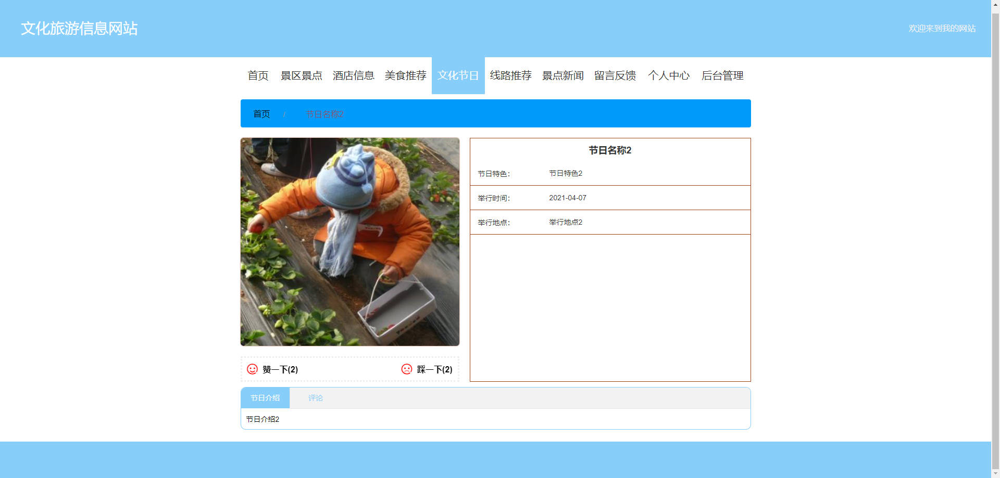
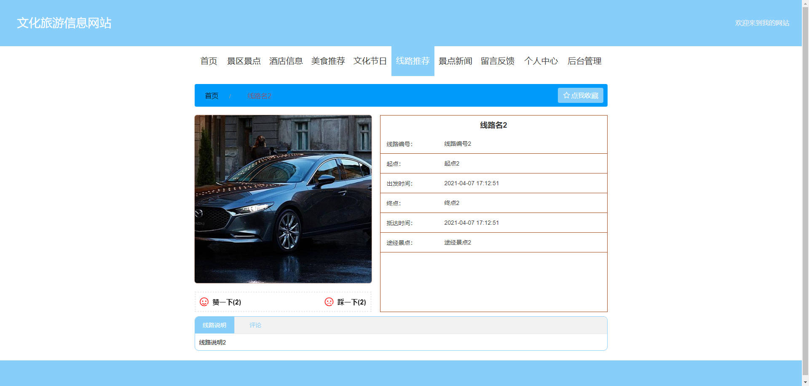
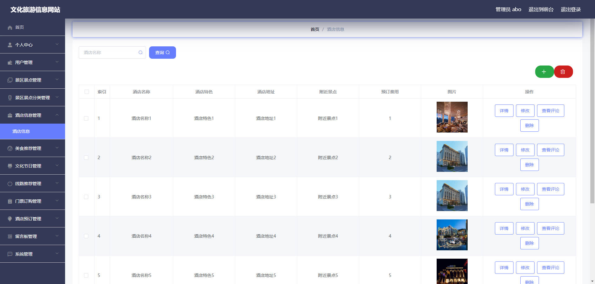
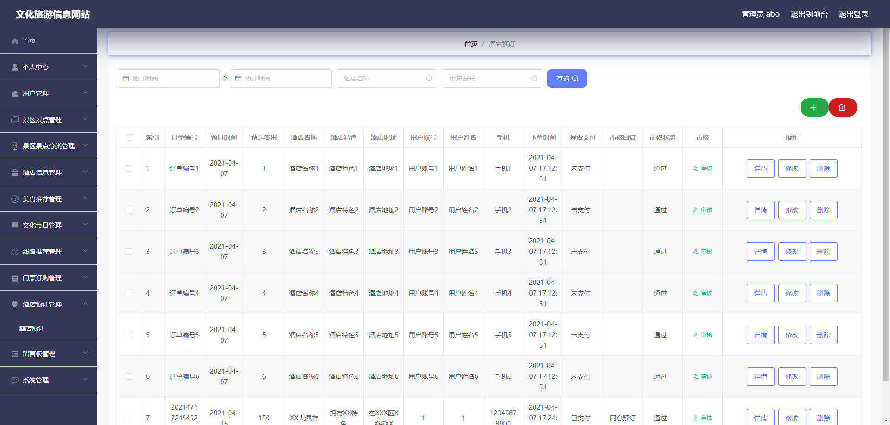

# 基于Springboot的文化旅游信息网站


# Springboot-059

### 技术栈

Springboot mybatisplus vue

## 数据库

mysql (28张表)


## 功能描述

~~~properties
管理员
登录
修改个人信息
用户管理新增、修改、查询、删除、
景区景点新增、修改、查询、删除、查看评论
景区景点分类新增、修改、查询、删除
酒店信息新增、修改、查询、删除、查看评论
美食推荐新增、修改、查询、删除、查看评论
文化节日新增、修改、查询、删除、查看评论
线路推荐新增、修改、查询、删除、查看评论
门票预订新增、修改、查询、删除、审核
酒店预订新增、修改、查询、删除、审核
留言板新增、修改、查询、删除、审核
轮播图新增、修改、查询、删除
景点新闻新增、修改、查询、删除
----------------------------------

​
用户:
注册、登录
修改个人信息
修改密码
景区景点查看、购票、评论、收藏、赞一下
酒店查看、预定、评论、赞一下
文化节日查看、评论、赞一下
线路查看、评论、收藏、赞一下
景点新闻查看
留言反馈新增
我的收藏列表查看
酒店预订记录查看、支付
门票预订记录查看、支付

~~~


## 运行截图

### 前台







### 后台





## 访问网址

### 前台

```
http://localhost:8080/springboothg785/front/index.html

账号 1
密码 1
```

### 后台

```
http://localhost:8080/springboothg785/admin/dist/index.html#/login

账号 abo
密码 abo
```


### 代码地址

### 网盘地址

### 视频地址


##  技术交流或打赏


代码仓库： [https://github.com/JiuJiangFirstDeepLove/057-Springboot](https://github.com/JiuJiangFirstDeepLove/058-Springboot) 

百度网盘：链接：https://pan.baidu.com/s/1Dfk2XCjsHJ7nLcrkMYBW2g?pwd=lez3 
提取码：lez3 
--来自百度网盘超级会员V6的分享

项目介绍： [基于Springboot的校友社交系统(附源码)-CSDN博客](https://blog.csdn.net/2301_77376019/article/details/134890820?csdn_share_tail={"type"%3A"blog"%2C"rType"%3A"article"%2C"rId"%3A"134890820"%2C"source"%3A"2301_77376019"}) 